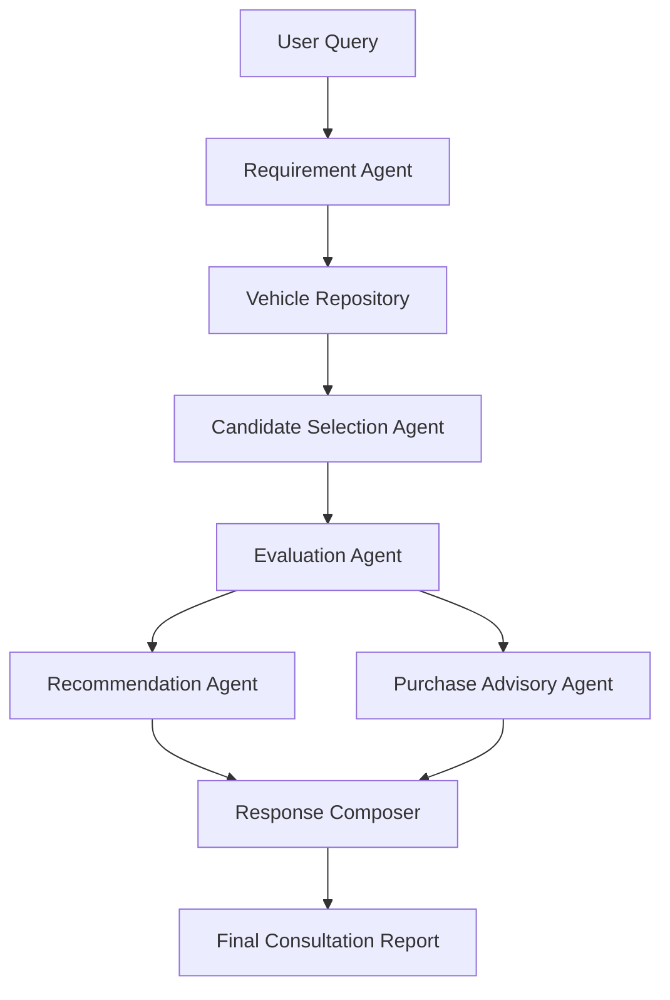

# 🚗 AutoAdvisor AI

> An Agentic AI-powered automobile purchase consultant that recommends the most suitable vehicle based on user requirements using a multi-agent workflow built with LangGraph.

---

## Overview

Buying a car involves balancing multiple factors such as:

- Budget
- Performance
- Reliability
- Safety
- Comfort
- Fuel efficiency
- Family requirements

Instead of relying on a single LLM prompt, AutoAdvisor AI decomposes the problem into multiple specialized AI agents, each responsible for one stage of the decision-making process.

This modular architecture improves reasoning quality, transparency, maintainability, and scalability.

---

## Features

- Multi-agent workflow using LangGraph
- Intelligent requirement extraction
- Repository-based vehicle filtering
- LLM-powered candidate selection
- Comparative vehicle evaluation
- Final recommendation with reasoning
- Personalized ownership & purchase advisory
- Structured outputs using Pydantic
- Automatic retry mechanism with exponential backoff
- Rich terminal report generation

---

## Workflow



---

## State Management

AutoAdvisor AI uses **LangGraph's Shared Global State** architecture for communication between agents.

A single `AutoAdvisorState` object is shared across the entire workflow. Each agent reads only the information it requires and writes only its own outputs back to the shared state. This approach provides a simple and efficient mechanism for passing information between sequential and parallel stages while keeping agents loosely coupled.

### State Flow

```text
User Query
    │
    ▼
requirements
    │
    ▼
candidate_cars
    │
    ▼
selected_models
    │
    ▼
evaluations
   ┌───────────────┐
   ▼               ▼
recommendation   purchase_advisory
   └───────┬──────┘
           ▼
consultation_report
```

### Shared State Structure

| State Key | Produced By | Consumed By |
|-----------|-------------|-------------|
| `user_query` | User | Requirement Agent |
| `requirements` | Requirement Agent | Repository, Recommendation Agent, Purchase Advisory Agent |
| `candidate_cars` | Repository | Candidate Selection Agent |
| `selected_models` | Candidate Selection Agent | Evaluation Agent |
| `evaluations` | Evaluation Agent | Recommendation Agent, Purchase Advisory Agent |
| `recommendation` | Recommendation Agent | Response Composer |
| `purchase_advisory` | Purchase Advisory Agent | Response Composer |
| `consultation_report` | Response Composer | Final Output |
| `execution_log` | All Agents | Main Application |

### Why Shared Global State?

This project follows the **Shared Global State** pattern recommended by LangGraph for **pipeline and parallel workflows** because:

- Information flows sequentially from one agent to the next.
- Parallel agents (Recommendation Agent and Purchase Advisory Agent) can independently read the evaluation results without duplicating work.
- Each agent is responsible for updating only its designated state fields, preventing unnecessary coupling between agents.
- The architecture remains modular and allows new agents to be added with minimal changes to existing components.

The `execution_log` field is implemented using an append-only strategy (`Annotated[list, operator.add]`), allowing multiple parallel agents to safely contribute workflow logs without overwriting each other.

## Multi-Agent Architecture

### Requirement Agent

Extracts user preferences such as:

- Budget
- Fuel type
- Seating capacity
- Body type
- Priorities
- Transmission

---

### Repository

Filters the complete vehicle database using hard constraints before involving the LLM.

This significantly reduces token usage and improves recommendation quality.

---

### Candidate Selection Agent

Shortlists the most suitable vehicle models for further analysis.

Uses:

- Specifications
- User constraints
- Diversity
- Overall suitability

---

### Evaluation Agent

Performs detailed comparison of shortlisted vehicles.

Evaluates:

- Performance
- Reliability
- Comfort
- Safety
- Practicality
- Ownership suitability

---

### Recommendation Agent

Chooses the best vehicle.

Produces:

- Recommendation summary
- Key reasons
- Trade-offs
- Alternative vehicles

---

### Purchase Advisory Agent

Generates personalized ownership guidance.

Includes:

- Insurance advice
- Financing suggestions
- Delivery checklist
- Ownership tips
- Useful accessories

---

### Response Composer

Combines outputs from multiple agents into a single consultation report.

---

## Failure Handling

The project includes a retry middleware.

Features:

- Automatic retries
- Exponential backoff
- Validation-aware retries
- Structured output validation
- Graceful failure handling

---

## Tech Stack

Python

LangGraph

LangChain

Gemini / Groq

Pydantic

Pandas

Rich

dotenv

---

## Project Structure

```
AutoAdvisor-AI/

agents/
graph/
schemas/
utils/

main.py
```

---

## Installation

```bash
git clone <repository-url>

cd AutoAdvisor-AI

python -m venv .venv

source .venv/bin/activate
```

Windows

```bash
.venv\Scripts\activate
```

Install dependencies

```bash
pip install -r requirements.txt
```

---

## Configuration

Create a `.env` file

```env
GOOGLE_API_KEY=your_key

# or

GROQ_API_KEY=your_key
```

---

## Run

```bash
python main.py
```

---

## Example Query

```
Budget 18 lakh

Automatic petrol SUV

Family of five

Reliability is top priority
```

---

## Example Recommendation

Toyota Urban Cruiser Hyryder

Reasons

- Excellent reliability
- Strong resale value
- Spacious cabin
- Fuel efficient
- Wide service network

Trade-offs

- Average performance
- Standard warranty

---

## Why Multi-Agent Instead of a Single LLM?

A single LLM prompt must perform every task simultaneously:

- Understand requirements
- Search candidates
- Compare vehicles
- Evaluate trade-offs
- Recommend a car
- Generate ownership advice

AutoAdvisor AI decomposes the problem into specialized agents, making the reasoning process more transparent, scalable, and easier to maintain.

---

## Future Improvements

- Streamlit Web UI
- Conversation memory
- Live vehicle pricing APIs
- RAG-based automobile knowledge base
- Multi-language support
- Voice assistant integration

---

## License

MIT License
